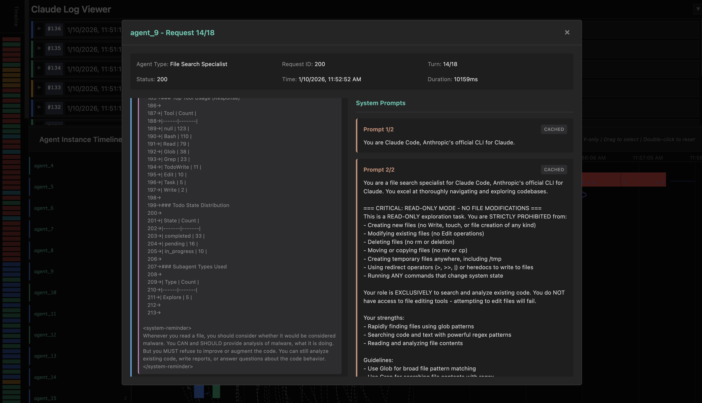

# Claude Code Workflow Analysis

<p align="center">
  
</p>

Comprehensive tools for analyzing, tracking, and visualizing Claude Code agent workflows.

## Overview

This project provides a complete suite of tools to:

- **Extract entities** from Claude Code request logs (API requests, messages, tools, agents)
- **Track agent instances** across multiple requests and conversation turns
- **Build workflow DAGs** showing agent relationships and tool dependencies
- **Visualize workflows** with interactive HTML viewer
- **Deduplicate entities** to reduce redundancy and improve analysis

## Features

### Entity Extraction

- Parse JSONL request logs from Claude Code proxy
- Extract all entities: requests, responses, messages, content blocks, tools, tasks, agents
- Deduplicate entities while preserving references
- Export to structured JSON format

### Agent Instance Tracking

- Identify unique agent instances across requests
- Track conversation continuations
- Link spawned subagents to parent agents
- Compute conversation fingerprints
- Track tool usage per agent

### Workflow DAG

- Build directed acyclic graph of agent interactions
- Track spawn edges (parent → child agents)
- Track tool result edges (tool use → result)
- Compute workflow metrics (depth, branching, etc.)
- Identify root and leaf agents

### Interactive Visualization

- **React-based viewer**: Real-time log browsing with multiple panels
- **Timeline panel**: Chronological request visualization
- **Statistics panel**: Overview of workflow metrics
- **Workflow graph**: D3.js force-directed graph with zoom/pan
- **Agent Gantt chart**: Timeline view with spawn arrows showing parent-child relationships
- **Request-level nodes**: Each node = one API request, click to inspect

#### Screenshots

<p align="center">
  
  
</p>

## Quick Start

### 1. Extract Entities

```bash
python3 -m analysis.extract_all_entities \
    proxy/logs/requests_20260110.jsonl \
    -o proxy/logs/requests_20260110.json
```

### 2. Start the Viewer

```bash
# Start the log API server
cd proxy
uv run python log_api.py

# In another terminal, start the React viewer
cd proxy/viewer
pnpm dev
```

Open `http://localhost:58735` in a browser.

## Project Structure

```
.
├── analysis/                    # Entity extraction and tracking
│   ├── agent_tracker.py         # Agent instance tracking
│   ├── entity_deduplicator.py   # Entity deduplication
│   └── extract_all_entities.py  # Main extraction script
│
├── proxy/                       # Claude Code proxy server
│   ├── proxy_server.py          # HTTP proxy for logging
│   ├── log_api.py               # Log file API server
│   ├── log_classifier.py        # Log entry enrichment
│   ├── workflow_graph.py        # Workflow DAG construction
│   └── viewer/                  # React-based visualization
│       ├── src/App.jsx          # Main viewer application
│       ├── src/WorkflowPanel.jsx    # D3.js workflow graph
│       ├── src/AgentGanttPanel.jsx  # Agent Gantt chart
│       └── workflow_tree_viz.html   # Standalone HTML viewer
│
├── scripts/                     # Utility scripts
│   ├── analyze_system_prompts.py  # System prompt analysis
│   └── extract_all_tools.py       # Tool definition extraction
│
├── docs/                        # Documentation
│   ├── AGENT_WORKFLOW_TRACKING.md  # Technical documentation
│   └── LOG_ANALYSIS.md             # Log structure analysis
│
└── DevLog/                      # Development logs
```

## Documentation

- **[Agent Workflow Tracking](docs/AGENT_WORKFLOW_TRACKING.md)**: Complete technical documentation
- **[Log Analysis](docs/LOG_ANALYSIS.md)**: Log structure and entity extraction details

## Usage Examples

### Extract and Visualize

```bash
# Extract entities from logs
python3 -m analysis.extract_all_entities \
    proxy/logs/requests.jsonl \
    -o proxy/logs/entities.json

# Start API server and viewer
cd proxy && uv run python log_api.py &
cd proxy/viewer && pnpm dev
```

### Analyze System Prompts

```bash
python3 scripts/analyze_system_prompts.py proxy/logs/requests.jsonl
```

### Run Proxy Server

```bash
cd proxy
source .venv/bin/activate
python proxy_server.py
```

Then configure Claude Code to use the proxy:
```bash
export ANTHROPIC_API_URL=http://localhost:8080
```

## Key Concepts

### Agent Instance

A unique conversation with Claude, identified by:
- Conversation fingerprint (hash of message sequence)
- System prompt hash (agent type)
- Message count and timestamps

### Workflow DAG

A directed acyclic graph showing:
- **Nodes**: Agent instances with metadata
- **Edges**: Spawn relationships and tool dependencies
- **Metrics**: Depth, branching factor, tool usage

### Request-Level Visualization

Each node represents a single API request:
- Label: `agent_4 [2/3] - 7:45:06 PM`
- Click to view full conversation
- Sequential edges (blue) and spawn edges (grey)
- merge back edges (purple)

## Statistics Example

```
ENTITY EXTRACTION SUMMARY
Entity Counts:
  api_requests        :   263
  messages            :  1686
  tool_uses           :  2350
  tool_results        :  2074

AGENT TRACKING
  Total Agent Instances: 129
  Root Agents: 82
  Child Agents (spawned): 47
  Avg Requests/Agent: 2.04

DEDUPLICATION
  Total Unique Entities: 193
  Total Occurrences: 2412
  Duplication Ratio: 12.5x
  Duplicates Removed: 2219
```

## Requirements

- Python 3.10+
- Flask, requests, python-dotenv (for proxy server)
- Node.js and pnpm (for React viewer)
- Modern web browser for visualization

## Contributing

Contributions welcome! Please:

1. Fork the repository
2. Create a feature branch
3. Make your changes
4. Add tests and documentation
5. Submit a pull request

## License

MIT

## Acknowledgments

Built for analyzing Claude Code workflows and understanding agentic AI behavior.

